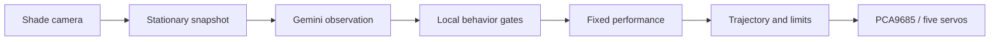

# PALA

**Programmable Autonomous Lamp Assistant** — a five-axis desk lamp with a little character.

PALA turns an IKEA NYMÅNE lamp into a physical desk companion. It notices someone sitting down, acknowledges a look toward its camera, celebrates a thumbs-up, follows a pointing direction, and settles back into a breathing rest pose. This is my first robotics portfolio project: custom printed mechanisms, embedded control, camera perception, and expressive motion brought together in a supervised V1 demo.

https://github.com/user-attachments/assets/bdd66a1e-fc92-461a-8403-59784bc540fe

**[Download the full-quality PALA V1 demo](https://github.com/djduecaster/pala/releases/tag/v0.1.0)** · 1 minute 47 seconds · The inline player uses a compressed copy; the full-quality film is distributed as `pala-v1-demo.mp4` in GitHub Releases. Its simulator and joint charts reconstruct commanded motion; they are not measured servo telemetry.

## The interaction

| You… | PALA… |
|---|---|
| Sit down and work | Makes a small noticing movement |
| Look toward the shade camera | Gives an expressive greeting |
| Give a thumbs-up | Leans forward, recoils, and adds coordinated yaw/pitch oscillations |
| Point left or right | Turns toward that general direction, then returns |
| Turn back to work | Disengages and settles into rest |
| Leave it resting | Breathes gently, with occasional yaw motion |

The performances were tuned on the real lamp through repeated operator ratings. Small movements often read poorly, so the final gestures use larger coordinated changes and distinct timing. The shade-mounted camera also shaped the resting posture: a useful view and a convincing pose had to work together.

## How it works

Gemini interprets a stationary camera snapshot and returns structured observations of presence, apparent attention, and visible gestures. Local Python logic decides whether an observation is fresh and appropriate for the current interaction stage, then selects a fixed performance. The model never supplies servo angles.



The core runtime retains four independent loops: perception, behavior, control, and hardware. Their shared contracts are `PerceptionState → ActionPlan → HardwareCommand`. Latest-value exchange avoids queues of old camera frames; execution applies configured joint limits, and the hardware loop has a deadman timeout. The deadman is software-only, not an independent electrical emergency stop;
hardware operation requires supervision. See the [architecture guide](docs/architecture.md).

| Layer | Implementation |
|---|---|
| Mechanism | IKEA NYMÅNE lamp, custom 3D-printed servo mounts, five hobby-servo joints |
| Compute and actuation | NVIDIA Jetson, PCA9685 PWM driver |
| Vision | Logitech shade-mounted camera, GStreamer capture, Gemini image observations |
| Control | Python, deterministic choreography, calibrated joint-to-servo mapping |
| Development | Mac dummy backends, browser simulator, gesture workshop, optional telemetry |
| Capture | Optional FFmpeg POV recording and frame/command logs |

## Try it without hardware

Install Python 3.10–3.12 and [uv](https://docs.astral.sh/uv/), then:

```bash
git clone https://github.com/djduecaster/pala.git
cd pala
uv sync
PALA_MAX_RUNTIME_S=3 uv run python -m pala.main --mode dev
uv run pytest -q
```

The default runtime holds position using dummy backends. It does not start the live camera-driven performance or call Gemini.

For the local motion simulator:

```bash
uv run python tools/primitive_sim/run.py --scenario studio --port 8766
```

Open <http://127.0.0.1:8766/tools/primitive_sim/web/lamp_sim.html>. The [simulator guide](tools/primitive_sim/README.md) covers playback and joint checking. Simulation is a preview of commanded geometry, not a physical validation.

For the physical demo, follow the [Jetson workflow](docs/jetson_agent_workflow.md), then the [live interaction guide](docs/live_interaction.md). Hardware runs require the calibrated mechanism, a clear workspace, the established zero posture, and local credentials. The live tool moves to rest and automatically arms after its startup checks. Rest and shutdown zero are intentionally different positions.

## V1 boundaries

This is a working, supervised prototype rather than continuous human tracking. Model requests introduce variable latency; observations pause during motion, and the seated demo framing is deliberately constrained. Pointing selects left/right choreography rather than locating an exact object. Hobby servos provide no measured joint feedback, so commanded trajectories and simulator traces cannot establish actual position. The fifth joint is available but largely unused in the final gestures because of its mechanical limitations.

V1 is a completed portfolio milestone. A future version could improve the mechanism, sensing, and responsiveness, but those are separate work rather than requirements for this demo.

## Recreating and reusing PALA

Start with the [recreation guide](docs/recreating_pala.md) for parts, calibration,
system dependencies and staged bring-up. CAD/STL and a few hardware details are
still pending; this is a documented prototype rather than a complete build kit.
Software and textual documentation are [MIT licensed](LICENSE).
[Separate scope rules](docs/licensing.md) apply to media and CAD.

## Explore the project

- [Documentation index](docs/README.md): current guides and dated evidence
- [Live interaction](docs/live_interaction.md): behavior, controls, timing, and limitations
- [Gesture workshop](docs/gesture_workshop.md): pose and performance tuning
- [POV recording](docs/pov_recording.md): camera-only and live-demo capture
- [Robot configuration](config/robot.yaml) and [desk performances](config/desk_performances.json)
- [Portfolio media](docs/portfolio_media.md): release asset and local production archive

`pala/` contains the runtime; `tools/` contains operator tools and simulator sidecars; `tests/` covers contracts and software behavior. Videos, raw captures, model files, and archived working notes remain local and ignored by Git. Passing software tests does not establish physical acceptance of a new motion recipe.
